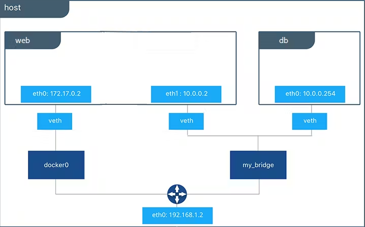

## DOCKER NETWORK
Docker network mengacu pada kemampuan container dalam komunikasi container satu sama lain dalam lingkup docker.



```bash
# cara membuat docker network
docker create network nama_network

# conton membuat 2 container berkomunikasi antar container dengan network
# membuat container untuk database_mongo
1. docker container create --name mongo_db_container --network nama_network -p 8080:27017 mongo:latest 
2. docker container start mongo_db_container

#membuat container untuk backend 
1. build terlebih dahulu untuk image yang diinginkan, jangan lupa apabila ingin menggunakan env dalam container docker harus apply  nama container db yang dibuat sebelumnya. 
EX envnya: MONGO_URI=mongodb://mongo_db_container:27017/datatesting , port yg digunakan adalah port dari container/hostnya bukan port external atau yg di expose. 
2. docker container create --name mongo_be_container --network nama_network -p 8080:27017 mongo_be_image
3. docker container start mongo_be_image
```

>[!NOTE]
perlu di ingat apabila network ingin berkomunikasi satu sama lain port yg digunakan harus port HOST bukan EXPOSE.
